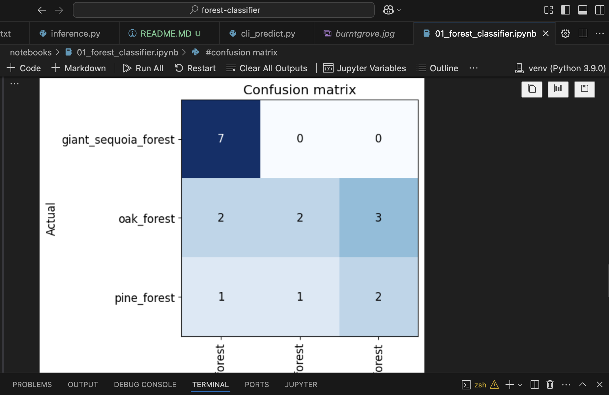
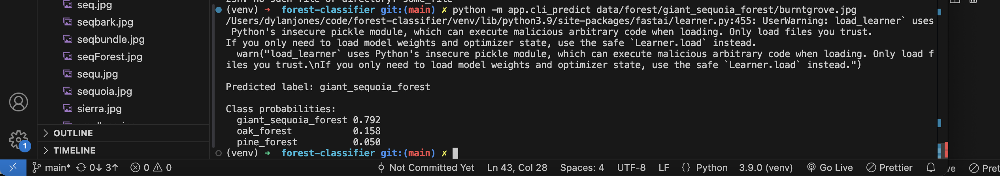
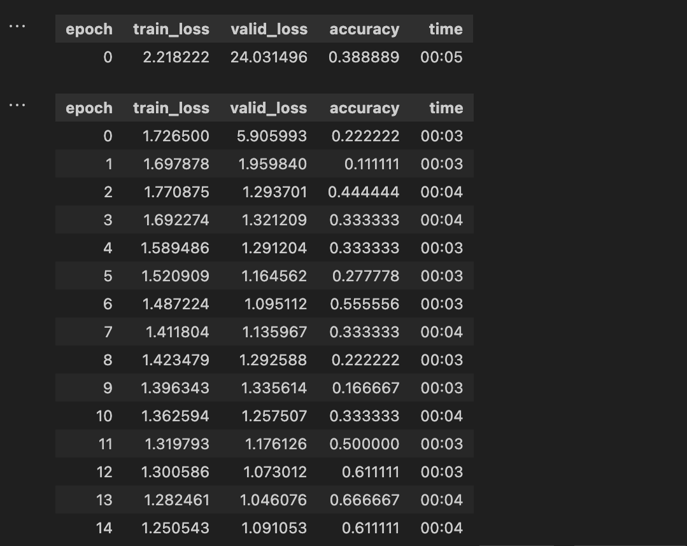

# Forest Classifier (fastai)

Small end-to-end computer vision project using [fastai](https://docs.fast.ai/) to classify forest images into three classes:

- `giant_sequoia_forest`
- `oak_forest`
- `pine_forest`

The goal is to demonstrate a **full ML lifecycle**:

> data → model → evaluation → export → local serving (CLI)

in a way that is easy to clone and run locally, even in an offline / SSL-restricted environment.

## Data & model files

To keep the repository lightweight and avoid committing large binaries, the
training data and exported model are **not** tracked in git.

- `data/` – expected directory for local images, e.g. `data/forest/<class_name>/*.jpg`
- `models/forest_classifier.pkl` – exported fastai learner created by the notebook

When you clone this repo you will **not** see `data/` or `models/` by default.

To reproduce my setup locally:

1. Create the folder structure and add your images:

   ```bash
   data/forest/giant_sequoia_forest/
   data/forest/oak_forest/
   data/forest/pine_forest/

---

## Features

- fastai vision pipeline (image folders → `DataLoaders` → `vision_learner`)
- ResNet34 model trained **from scratch** (`pretrained=False`)
- Evaluation with accuracy + confusion matrix
- Exported model artifact: `models/forest_classifier.pkl`
- Simple Python **CLI** for local inference:

    python -m app.cli_predict path/to/image.jpg

- Notes on how this could be turned into a real ML/AI service (FastAPI + Docker + CI/CD)

---

## Tech stack

- Python 3.9  
- fastai (vision)  
- PyTorch / torchvision  
- fastcore  
- Jupyter Notebook  
- CLI app using the standard library `argparse`

---

## Project structure

    AI-ML-forest-classifier-/
      app/
        __init__.py             # empty, marks app/ as a package
        inference.py            # loads the fastai learner and exposes predict_image()
        cli_predict.py          # CLI entrypoint: python -m app.cli_predict <image>
      data/
        forest/
          giant_sequoia_forest/ # manually collected images
          oak_forest/
          pine_forest/
        export.pkl              # fastai default export (created by the notebook)
      models/
        forest_classifier.pkl   # copied/renamed export used by the app
      notebooks/
        01_forest_classifier.ipynb  # training, evaluation, export
      requirements.txt
      venv/                     # local virtualenv (not required for consumers)

---

## Dataset

The dataset is intentionally small and hand-collected.

Images are stored as:

    data/forest/<class_name>/*.jpg|*.png

Classes:

- `giant_sequoia_forest`
- `oak_forest`
- `pine_forest`

Images were saved manually into these folders rather than downloaded automatically so that the entire project can run in an **offline / SSL-restricted** environment.

---

## Training & evaluation

Training lives entirely in:

    notebooks/01_forest_classifier.ipynb

The notebook performs the following steps.

### Data setup

- Creates `data/forest/...` folders if they don’t exist.  
- Assumes images are already present in those folders.  
- Verifies and removes corrupt images.

### DataLoaders

- Uses `ImageDataLoaders.from_folder(...)` to create training / validation splits.  
- Resizes images to 224×224.

### Model

Builds a `vision_learner` with a ResNet34 backbone:

    learn = vision_learner(
        dls,
        resnet34,
        metrics=accuracy,
        pretrained=False   # trained from scratch due to offline constraints
    )
    learn.fine_tune(15)

### Evaluation

- Tracks training / validation loss and accuracy across epochs.  
- Uses `ClassificationInterpretation` to visualize a confusion matrix.




### Export

Exports the trained learner via:

    learn.export()  # saves to data/forest/export.pkl by default

Copies the file to:

    models/forest_classifier.pkl

---

## Current performance

On the current tiny validation set, overall accuracy is around **61%**. Performance is much stronger on the `giant_sequoia_forest` class (it correctly classifies the large majority of sequoia images, roughly **80–90%+** of held-out examples). Most mistakes happen between the `oak_forest` and `pine_forest` classes, which I suspect is due to the small dataset size and several long-distance / low-detail photos. With more and clearer oak/pine images, the model’s accuracy in those categories should improve.


Given:

- very small number of images per class  
- visually similar classes (oak vs pine)  
- no pretrained ImageNet weights (`pretrained=False`, offline training)

this accuracy is expected and is sufficient for this project’s purpose:

> demonstrating an end-to-end ML pipeline, not a production-grade classifier.

---

## Environment / SSL constraints

This project is designed to run in environments where:

- outbound HTTPS requests may fail or be intercepted  
- downloading pretrained model weights or external images is not reliable  

As a result:

- image search helpers like `fastbook.search_images_ddg` are **not** used here  
- the ResNet34 model is trained with `pretrained=False`, avoiding any external downloads  
- all images are added manually to `data/forest/...`

In a fully open environment, the same pipeline could easily be modified to:

- auto-download images using `fastbook.search_images_ddg`, and  
- use pretrained ResNet weights for faster convergence and higher accuracy.

---

## Local setup

Clone the repo and create a virtual environment:

    git clone https://github.com/djones1117/AI-ML-forest-classifier-.git
    cd AI-ML-forest-classifier-


    python3 -m venv venv
    source venv/bin/activate  # Windows: venv\Scripts\activate

Install dependencies:

    pip install -r requirements.txt

`requirements.txt` (for reference):

    fastai
    torch
    torchvision
    fastcore
    Pillow
    matplotlib
    jupyter
    ipykernel

---

## CLI inference

Once `models/forest_classifier.pkl` exists (either from the repo or by re-running the notebook), you can run predictions locally via the CLI.

From project root:

    source venv/bin/activate
    python -m app.cli_predict path/to/your_image.jpg

Example using a training image:

    python -m app.cli_predict data/forest/giant_sequoia_forest/redwood.jpg

Sample output:

    Predicted label: giant_sequoia_forest

    Class probabilities:
      giant_sequoia_forest  0.792
      oak_forest            0.158
      pine_forest           0.050



The CLI uses:

- `app/inference.py` → loads `models/forest_classifier.pkl`, exposes `predict_image(image_path)`  
- `app/cli_predict.py` → minimal `argparse` wrapper to run predictions from the command line  

---

## (Optional) re-running training

If you want to re-train the model:

1. Make sure `data/forest/...` contains your images.  
2. Activate your venv:

       source venv/bin/activate

3. Launch Jupyter:

       jupyter notebook notebooks/01_forest_classifier.ipynb

4. Run the notebook top-to-bottom:

   - Cell 1: imports & paths  
   - Cell 2–3: folder setup + cleanup  
   - Cell 4–5: create `DataLoaders` + train  
   - Optional cell: confusion matrix  
   - Cell 6: export and copy to `models/forest_classifier.pkl`  



---

## Improving accuracy (future work)

If this model needed to be more than a project, accuracy can be improved via:

### More and better data

- Collect more images per class (ideally hundreds+).  
- Ensure labels are correct and classes are visually distinct.  
- Balance the number of samples per class.
- Use images from closer up and not from a distance

### Data augmentation

- Use fastai transforms (flips, rotations, lighting changes) to improve robustness.

### Pretrained weights (when SSL / network is available)

- Switch back to `pretrained=True` and allow fastai/torchvision to download ResNet weights.  
- This typically gives a large boost in performance, especially with limited data.

### Simplified task

Reframe the problem as:

- `giant_sequoia_forest` vs `non_sequoia_forest`, or  
- `needle_leaf` vs `broadleaf`, etc.

Fewer, more visually distinct classes often improve accuracy.

### Better validation

- Use a larger validation set.  
- Track metrics across multiple runs to ensure stability.

---

## How I would productionize this (MLOps mindset)

Given more time and real data, the next steps toward a production-ready service would be:

### API service

- Wrap `predict_image` in a small FastAPI app with a `/predict` endpoint that accepts an image file and returns JSON.

### Containerization

- Package the service and model into a Docker image (Python slim + CPU-only Torch).  
- Mount or bake `forest_classifier.pkl` into the image.

### CI/CD

Add a CI workflow that:

- runs unit tests on `app/inference.py`  
- runs a test prediction with a known image  
- optionally runs a small regression suite on a holdout set  

Push the Docker image to a registry on successful builds.

### Deployment

Deploy to a managed service like:

- Google Cloud Run  
- AWS ECS 

and put it behind an authenticated API gateway.

### Monitoring

- Log per-request latency, error rates, and per-class prediction counts.  
- Optionally store anonymized predictions for drift / performance analysis.

This repo focuses on the **core pipeline and local serving**, but is structured so that adding a FastAPI app and Dockerfile would be straightforward next steps.
